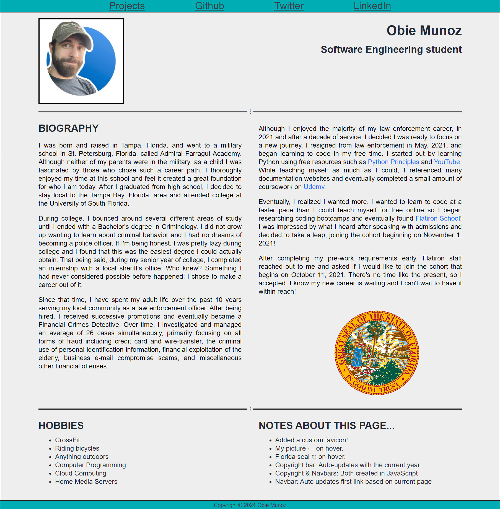
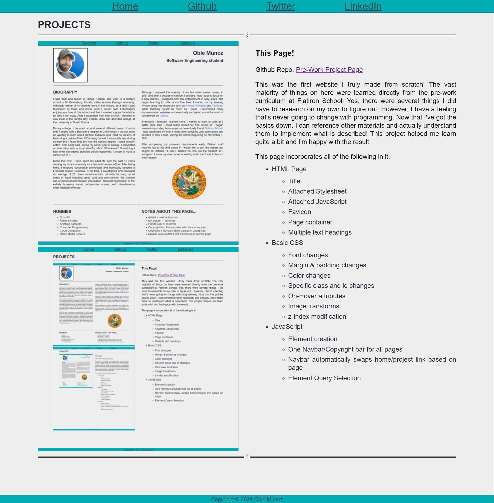

# My Personal Page
#### PROJECT START DATE:	10/05/2021
#### PROJECT END DATE:	10/06/2021

This was the first website I truly made from scratch! The vast majority of things on here were learned directly from the pre-work curriculum at Flatiron School. Yes, there were several things I did have to research on my own to figure out; However, I have a feeling that's never going to change with programming. Now that I've got the basics down, I can reference other materials and actually understand them to implement what is described! This project helped me learn quite a bit and I'm happy with the result.

<table align="center">
  <tr>
    <td></td>
    <td></td>
  </tr>
</table>

This page incorporates all of the following in it:
- HTML Page
  - Title
  - Attached Stylesheet
  - Attached JavaScript
  - Favicon
  - Page container
  - Multiple text headings

- Basic CSS
  - Font changes
  - Margin & padding changes
  - Color changes
  - Specific class and id changes
  - On-Hover attributes
  - Image transforms
  - z-index modification

- JavaScript
  - Element creation
  - One Navbar/Copyright bar for all pages
  - Navbar automatically swaps home/project link based on page
  - Element Query Selection

